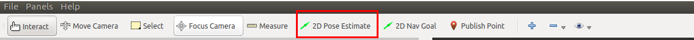
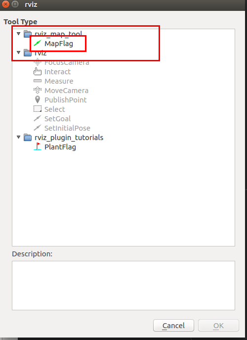
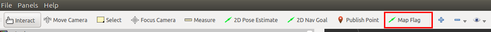
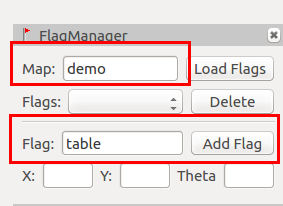

#CO602A AGV使用教程
通过本教程可以习得华数CO602A+AGV复合机器人的使用。
##环境配置
在开始前需要做以下的初始配置。

###连接wifi
复合机器人装有wifi发射器。  
wifi名称：`WIFI-03D148`  
wifi密码：`无密码`

###登录复合机器人控制器
通过ssh可以登录到复合机器人的控制器中  
用户名称：`shansu`  
密码：`123`  

```bash
$ ssh shansu@192.168.99.30
$ # 输入密码123
```

!!! Note
	本文后面中提到的登录复合机器人控制器，均可参考此处

###分布式配置
在本平台中，是通过wifi与复合机器人的控制器进行通讯，在复合机器人控制器运行ROS的master节点。用户上位机需要与复合机器人底盘通讯则需进行分布式配置。步骤如下：
1，获取本机IP地址和主机名称
```bash
$ ifconfig #获取本机IP地址
$ cat /etc/hostname #获取本机的主机名称
```

2，将本机IP地址和主机名称写入复合机器人控制器的hosts文件中
```bash
$ ssh shansu@192.168.99.30 #登录底盘
$ vim /etc/hosts #编辑hosts文件
```
在最后一行中加入：

	本机的IP地址	本机的主机名称

例如：

	192.168.99.233	fshs-kinetic

3，将复合机器人控制器的IP地址和主机名称写入本机的hosts文件中
```bahs
$ vim /etc/hosts #编辑本机的hosts文件
```
在最后一行中加入：

	192.168.99.30	shansurobotics

4，配置环境变量
可以通过指令的形式来导入环境变量
```bash
$ export ROS_HOSTNAME=本机主机的名称 # 如：export ROS_HOSTNAME=fshs-kinetic
$ export ROS_MASTER_URI=http://shansurobotics:11311
```
或者将其写入至脚步文件中，然后通过source指令来导入环境变量，方便使用。

!!! Note
	由于配置分布式后，讲无法与本机的ROS程序通讯，因此不建议将环境变量直接写入至.bashrc文件中

## 基础教程
在完成上述的基础环境配置后，就可以开始我们的基础使用教程了。

### 建图
不管在进行底盘导航还是移动物体抓取时，首先都需要将环境的地图构建出来。
```bash
$ ssh shansu@192.168.99.30 #登录底盘
$ roslaunch ir100_navigation ir100_gmapping.launch
```

在建图过程中，可以在本机上可视化建图过程
```bash
$ roslaunch hsr_bringup view_nav.launch #该指令在本机上执行
```

执行完上述指令后，移动底盘便已经开始建图了，这时可以通过操控手柄来控制底盘走一圈需要被构建的环境。

!!! Note
	在构建地图的时候，人应当站在移动底盘的后方来控制移动底盘运动。且尽量避免弧形的运动，需要转向时最好先讲移动底盘停止下来在进行旋转

当已经控制移动底盘绕环境走一圈后就可以保存地图了。`这时先不要关闭建图程序`，新开一个终端执行以下指令
```bash
$ ssh shansu@192.168.99.30 #登录底盘
$ rosrun map_server map_saver -f ~/work/maps/test_map #保存地图至~/work/maps/目录，地图名称为test_map
```

!!! Note
	当保存完地图后再讲建图程序关闭

### 导航
在将地图构建完成后便可进行导航实验。

1，在复合机器人控制器上启动导航程序
```bash
$ ssh shansu@192.168.99.30 #登录底盘
$ roslaunch ir100_navigation ir100_navigation.launch
```

2，在本机上可视化导航过程
```bash
$ roslaunch hsr_bringup view_nav.launch
```

3，给定机器人的初始位置
点击2D Pose Estimate工具，在地图上标记当前实际机器人在地图上的位置


4，更新机器人定位
在给定机器人的初始位置后，可能会有偏差，可以通过下面的指令来更新迭代机器人的定位
```bash
$ rosservice call /request_nomotion_update
```

!!! Note
	可以多次执行直到机器人定位较为精确后。

5，给定目标点
在给定和更新机器人的初始位置后，便可以为机器人指定目标点，来让机器人导航至目标点。
点击RVIZ中的2D Nav Goal工具，在地图上标记一个目标点。标记后，机器人便会开始运动。


### 创建地图标记
为了进行移动抓取应用，我们需要在地图上创建标记来协助进行移动抓取。
在导航程序没有关闭的情况下，使用RVIZ中的map flag工具来对地图进行标记。

1，点击RVIZ菜单栏中的Panels -> Add New Panels，选择rviz_map_tool下的FlagManager；


2，点击工具栏中的＋，选择添加rviz_map_tool下的MapFlag；



3，选择工具栏中的Map Flag工具，然后再地图上标记第一个标记点。（对应物理世界的桌子处）


4，在FlagManager窗口中，Map名称设置为demo，Flag名称设置为table，并点击Add Flag按钮


5，按照第3、4步，添加多一个标记点（对应物理世界中的任意一个空旷处），并将其Flag名称设置为home，并添加。

在创建完flag后，需要将flag信息下载到复合机器人控制器中，指令如下
```bash
$ scp -r ~/.hirop/data/MAP/demo/ shansu@192.168.99.30:~/.hirop/data/MAP/demo
```

##测试移动抓取应用
在掌握上述的基础教程后，就可以开始学习如何使用移动抓取应用了。
---
### 应用介绍
该应用启动后，复合机器人会自动导航至桌子前方。然后使用手眼相机识别桌面上的牛奶盒，并且将牛奶盒抓取放置在移动地盘上。
当桌面上的所有牛奶盒都被抓取放置后，复合机器人便会导航回到home点。

---
###启动环境

1，启动依赖环境
```bash
$ ssh shansu@192.168.99.30 #登录复合机器人控制器
$ roslaunch hsr_agv_bringup move_pick_app_go.launch
```

2，启动感知模块
新建一个终端
```bash
$ ssh shansu@192.168.99.30 #登录复合机器人控制器
$ rosrun perception_bridge perception_bridge.py
```

3，初始化
新建一个终端
```bash
$ rosservice call /set_robot_enable true #给机械臂上使能
$ rosservice call /serial_open /dev/ttyUSB0 115200 #设置夹爪的串口号及波特率
$ rosservice call /set_pick_place_vel_acc 0.3 0.05 #设置抓取时机械臂的速度和加速度
```

4, 定位
参考导航小节中为机器人指定初始位姿的来指定当前机器人在实际环境中的位置。

5，启动应用
新建一个终端
```bash
$ ssh shansu@192.168.99.30 #登录复合机器人控制器
$ rosrun app_move_pick app_move_pick
$ # 键入7，执行连续抓取
```
---
##参数修改
在使用过程中，如果是严格按照上述教程进行实验则无须修改相关参数。但如果修改了相关名称或者有特殊需求，则需要修改相关参数来进行适配。

!!!Note
	学习修改相关的参数也有助与理解应用的原理

1，修改地图名称：查看和修改hsr_agv_bringup move_pick_app_go.launch

2，修改标记地图名称：修改app_move_pick中的auto_move_pick.cpp的第20行

3，修改物体放置的位姿：修改app_move_pick中的auto_move_pick.cpp中的initPlace函数。
