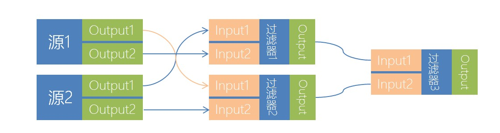
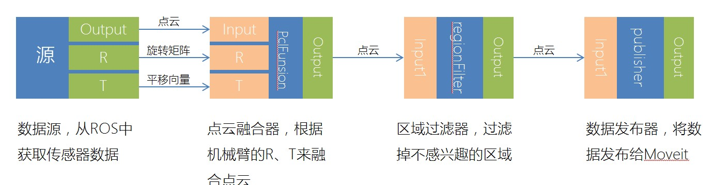

#HIROP感知模块编程指南
通过学习本指南可以掌握如何开发一个HIROP的感知模块插件。
	
##感知模块介绍	
hirop perception模块可以使我们的机器人具有感知能力。

在HIROP中，将感知分为两部分：前端和后端。
其中，前端指通过各种传感器（如：视觉、触觉、听觉）及相关处理算法（如：计算机视觉、PCL）以尽量精确的方式进行环境建模。
后端指的是，当通过前端将环境建模后经过一系列诸如语义分割、物体识别、物体分割等方法将物理世界以抽象的方式进行表达。
当前HIROP的感知模块仅实现了“前端”。
	
##感知模块的框架
感知模块采用了实现了管道流和图计算的[ECTO](http://plasmodic.github.io/ecto/)作为主框架。其中有四个关键的概念：源（Source）、过滤器（Filter）、发布器（Publisher）、图（Graph）。

* 1，当数据从传感器中读出后，会按顺序流向感知模块的不同过滤器（从传感器中获取数据的过滤器就是Source）；
* 2，当数据经过过滤器时，过滤器会通过相关相关算法对数据进行修改（这就是Filter的作用）；
* 3，当数据流过所有的过滤器后，会通过一个过滤器将数据发布出去（发布数据的特殊过滤器就是Publisher）；
* 4，感知模块可以根据需求随意的连接相关过滤器来构成一个图（Graph可以根据需求随意变化）。



##简单的Graph

	

#编程

!!!Note
	当前感知模块的所有数据均为点云，下面的所有教程均以编写点云的过滤器为例子。
	

---

##下载源码
HIROP感知模块是作为HIROP的一个子模块存在，因此需要下载完整的HIROP工程。
```bash
$ git clone https://github.com/HSRobot/hirop.git
$ cd hirop ; mkdir build; cd build
$ cmake ../
$ make
$ make install
$ echo 'PYTHONPATH=/usr/local/lib/python2.7/dist-packages/hirop_perecption/:$PYTHONPATH' >> ~/.bashrc
```
---
##编写过滤器

在hirop/src/perception/filter/中创建过滤器的源文件(myfilter.cpp)和头文件(myfilter.h)。

`myfilter.h`
```c++
#pragma once
#include <ecto/ecto.hpp>
#include <ecto_pcl/ecto_pcl.hpp>

using ecto::tendrils;
namespace hirop_perception{
class MyFilter{

public:
    /**
     * @brief MyFilter      构造函数
     */
    MyFilter(){}

    /**
     *  析构函数
     */
    ~MyFilter(){}
	
	/**
     * @brief   定义过滤器参数
     */
    static void declare_params(tendrils& params);

    /**
     * @brief   定义过滤器输入输出
     */
    static void declare_io(const tendrils& params, tendrils& in, tendrils& out);

    /**
     * @brief   过滤器的过滤实现
     */
    template <typename Point>
    int process(const tendrils& inputs, const tendrils& outputs,
                boost::shared_ptr<const pcl::PointCloud<Point> >& input);

    /**
     * @brief   过滤器的配置
     */
    void configure(const tendrils& params, const tendrils& inputs, const tendrils& outputs);
	
private:
	float _z;
};
}

```
---
`myfilter.cpp`
```C++
#include "myfilter.h"

using namespace hirop_perception;

void MyFilter::declare_params(tendrils& params){
	params.declare<float>("Z", "The pointcolud vaild Z area", 5);
}

void MyFilter::declare_io(const ecto::tendrils &params, ecto::tendrils &in, ecto::tendrils &out){
    in.declare<ecto::pcl::PointCloud>("input", "The colud to filter");
    out.declare<ecto::pcl::PointCloud>("output", "The colud to out");
}

void MyFilter::configure(const ecto::tendrils &params, const ecto::tendrils &inputs, const ecto::tendrils &outputs){
	_z = params.get<float>("Z");
}

template<typename Point>
int MyFilter::process(const tendrils& inputs, const tendrils& outputs,
                boost::shared_ptr<const pcl::PointCloud<Point> >& input){
	
	typename pcl::PointCloud<Point>::Ptr outPointCloud(new pcl::PointCloud<Point>);
	
	int size = input->points.size();
	
	for(int i =0; i < size; i++){
        if(input->points[i].z < _z)
			outPointCloud->points.push_back(cloud->points[i]);
    }
	
	outPointCloud->height = 1;
    outPointCloud->width = outPointCloud->points.size();
	
	outputs.get<ecto::pcl::PointCloud>("output") = ecto::pcl::PointCloud(outPointCloud);
	
    return ecto::OK;
}

ECTO_CELL(hirop_perception, ecto::pcl::PclCell<MyFilter>,\
          "VoxelFilter", "The point cloud voxel filter")

```

##代码解析

###必要的头文件
我们需要在filter.h中导入必要的头文件
```C++
#include <ecto/ecto.hpp>
#include <ecto_pcl/ecto_pcl.hpp>
```
###过滤器的关键函数

- *declare_params*函数：
```C++
void MyFilter::declare_params(tendrils& params){
	params.declare<float>("Z", "The pointcolud vaild Z area", 5);
}
```
该函数用于声明过滤器的参数。在下面的代码里，我们声明了MyFilter这个过滤器有个名为`Z`，类型为`float`的参数。用于配置过滤器应当过滤什么范围以外的数据。

---

- *declare_io*函数：
```C++
void MyFilter::declare_io(const ecto::tendrils &params, ecto::tendrils &in, ecto::tendrils &out){
    in.declare<ecto::pcl::PointCloud>("input", "The colud to filter");
    out.declare<ecto::pcl::PointCloud>("output", "The colud to out");
}
```
该函数用于声明过滤器的输入和输出。每个过滤器均有输入和输出。在本例中我们有一个名为`input`，类型为`ecto::pcl::PointCloud`的输入，用于从上一级过滤器中介绍点云。
以及一个名为`output`，类型为`ecto::pcl::PointCloud`的输出，用于将点云输出到下一级过滤器中。

---

- *configure*函数：
```C++
void MyFilter::configure(const ecto::tendrils &params, const ecto::tendrils &inputs, const ecto::tendrils &outputs){
	_z = params.get<float>("Z");
}
```
该函数的作用在于：当过滤器被初始化时来完成过滤器内部的初始化，比如处理相关参数。在本例中，configure函数只是将过滤器参数`Z`保存起来而已。

---

- *process*函数：
```C++
template<typename Point>
int MyFilter::process(const tendrils& inputs, const tendrils& outputs,
                boost::shared_ptr<const pcl::PointCloud<Point> >& input){
	
	typename pcl::PointCloud<Point>::Ptr outPointCloud(new pcl::PointCloud<Point>);
	
	int size = input->points.size();
	
	for(int i =0; i < size; i++){
        if(input->points[i].z < _z)
			outPointCloud->points.push_back(cloud->points[i]);
    }
	
	outPointCloud->height = 1;
    outPointCloud->width = outPointCloud->points.size();
	
	outputs.get<ecto::pcl::PointCloud>("output") = ecto::pcl::PointCloud(outPointCloud);
	
    return ecto::OK;
}
```
整个过滤器最重要的函数，用于对数据进行处理。在本例中，我们只是简单的将Z轴大于`_z`的点云给丢弃。然后通过下面的两行代码将过滤后的点云输出至下一级过滤器中。
```C++
	outputs.get<ecto::pcl::PointCloud>("output") = ecto::pcl::PointCloud(outPointCloud);
	return ecto::OK;
```

---

### 导出过滤器
最后，我们需要通过下面的代码来导出我们刚刚完成的过滤器。
```C++
ECTO_CELL(hirop_perception, ecto::pcl::PclCell<MyFilter>,\
          "MyFilter", "My first filter")
```
`ECTO_CELL`宏的参数描述：
- hirop_perception：生成的感知模块的名称
- ecto::pcl::PclCell<MyFilter>：声明实习过滤器功能的类
- "MyFilter"：过滤器的名称
- "My first filter"：过滤器的描述

---

###配置工程
在完成代码的编写后，我们还需要配置相关的工程来将我们的过滤器编译。
在hirop/src/perception/filter/CMakeLists.txt的ectomodule函数前中添加以下代码
```CMake
SET(SOURCES
    ${SOURCES}
    myfilter.cpp)
```

---

###编译工程
```bash
$ cd hirop/build
$ make
$ sudo make install
```

---

##测试过滤器
在完成上述的教程后，我们就可以来测试下我们的过滤器，看看其是否有效。首先让我们创建一个python文件:perception_test.py，输入以下内容：
```Python
#!/usr/bin/env python
# -*- coding: utf-8 -*- 

import hirop_perception
import rospy
import ecto, ecto_pcl, ecto_ros

if __name__=="__main__":

	# 初始化ROS节点
	ecto_ros.init(sys.argv, "perception_test")
	rospy.init_node('ros_test')

	# 构造一个从ROS话题中获取数据的过滤器，第一个参数是过滤器的名称，第二个参数是话题名称，第三个是将点云转换到的目标坐标系
	rosSource = hirop_perception.PointCloudRos('source', topic_name="/camera/depth/points", world_frame='base_link')	
	
	# 构造一个将过滤器输出发布到ROS话题的过滤器，第一个参数是过滤器的名称，第二参数是发布的点云的参考坐标系
	publisher = hirop_perception.PointCloudPublish("publisher", frame_id="base_link")
	
	# 构造一个我们刚刚制作的自己的过滤器，设置过滤距离为2米
	myFilter = hirop_perception.MyFilter('myFilter', Z=2)

	# 构造一个点云可视化窗口过滤器
	pclViewer = ecto_pcl.CloudViewer("viewer", window_name="PCD Viewer")
	
	# 声明一个计算图
	testPlasm = ecto.Plasm()
	
	# 定义计算图的结构
	testPlasm.connect(rosSource["output"] >> self.myFilter["input"], self.myFilter["output"] >> self.pclViewer["input"], self.pclFunsion["output"] >> self.publisher["input"])
	
	# 运行计算图
	sched = ecto.Scheduler(lookPlasm)
	
	# 进入ROS的消息循环
	rospy.spin()
```
直接运行脚本后，在接收到点云的时候会弹出一个窗口，正常的情况下应该可以看到Z大于2m的点云全部被过滤掉了。

#完成
至此，所有教程均已结束
